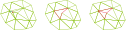
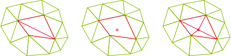
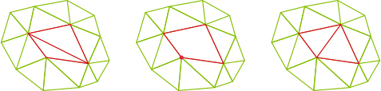
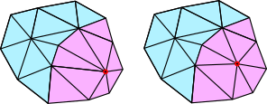
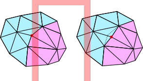

# Cavity operators

## Remesher implementation: the cavity operator

Given a mesh entity $e$ (a vertex or an edge in the present case), the cavity $C(e)$ is the set of mesh elements that contain the entity $e$.

A cavity $C(e)$ can be filled from a vertex $v$ as the set of elements created from $\mathbf v$ and the faces of the boundary of the cavity $\partial C(e)$ (oriented outwards).
$$ \mathcal F(\mathbf v,C(e))= \{ K=(\mathbf v, \mathbf g_1, \cdots, \mathbf g_d) | g = (\mathbf g_1, \cdots, \mathbf g_d) \in \partial C(e), \mathbf v \notin g\}$$

## Edge collapse using cavity operators

The collapse of edge $e_{i,j} = (\mathbf x_i, \mathbf x_j)$ can be performed as follow
- check the tags
    - if $dim(e_{i,j}) >  dim(\mathbf x_i)$ and $dim(e_{i,j}) > dim(\mathbf x_j)$, do not collapse
    - if $dim(e_{i,j}) >  dim(\mathbf x_i)$ and $dim(e_{i,j}) = dim(\mathbf x_j)$, swap indices $i$ and $j$
- build the vertex cavity $C(\mathbf x_i)$
- fill the vertex cavity from $\mathbf x_j$: $F = \mathcal F(\mathbf x_j,C(\mathbf x_i))$
- if $F$ passes all the criteria for swaps
    - remove all the elements from $C(\mathbf x_i)$ from the mesh
    - insert all the elements from $F$ to the mesh

> What to do with the metric $\mathcal M_i$?

## Edge split using cavity operators

The collapse of edge $e_{i,j}$ can be performed as follow
- build the edge cavity $C(e_{i,j})$
- create the midpoint $\mathbf x = (\mathbf x_i + \mathbf x_j) / 2$, project it onto the geometry if needed, and compute the metric $\mathcal M = \exp((\log(\mathcal M_i) + \log(\mathcal M_j)) / 2)$
- fill the vertex cavity from $\mathbf x$: $F = \mathcal F(\mathbf x,C(\mathbf e_{i,j}))$
- if $F$ passes all the criteria for swaps
    - remove all the elements from $C(\mathbf e_{i,j})$ from the mesh
    - insert verted $\mathbf x$ (with metric $\mathcal M$) to the mesh
    - insert all the elements from $F$ to the mesh

## Edge swap using cavity operators

The swap of edge $e_{i,j}$ can be performed as follow
- build the edge cavity $C(e_{i,j})$
- compute $q_{min} = \min_{K \in C(e_{i,j})} q(K)$
- if $q_{min}$ is too low, loop over all the vertices $\mathbf x$ on the boundary of C (that are neither $\mathbf x_i$ nor $\mathbf x_j$)
    - fill the vertex cavity from $\mathbf x$: $F = \mathcal F(\mathbf x,C(\mathbf e_{i,j}))$
    - if $F$ passes all the criteria, it is a valid candidate
- if valid candidates are available, let $F_0$ be the best one (the one with for which the minimum element quality is maximum) 
    - remove all the elements from $C(\mathbf e_{i,j})$ from the mesh
    - insert all the elements from $F_0$ to the mesh

## Smoothing using cavity operators

The smoothnig of vertex $\mathbf x_{i}$ can be performed as follow
- build the vertex cavity $C(\mathbf x_{i})$
- compute $q_{min} = \min_{K \in C(\mathbf x_{i})} q(K)$
- compute the subset of the vertices in $C(\mathbf x_{i})$ that are tagged in the same entity as $\mathbf x_{i}$ or one of its children, and average the positions of these vertices to obtain the new position $\mathbf x$
- if $\mathbf x_{i}$ is on a boundary, project $\mathbf x$ on the geometry
- fill the vertex cavity from $\mathbf x$: $F = \mathcal F(\mathbf x,C(\mathbf x_{i}))$
- if $\min_{K \in F} q(K) < q_{min}$:
    - locate the element of $C(\mathbf x_{i})$ that contains $\mathbf x$ (or is the closest), and interpolate the metric in $\mathbf x$ using the barycentric coordinates 
    - update the location and metric of vertex $i$
