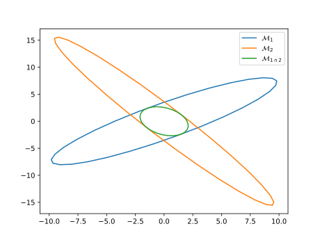
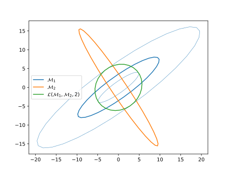

# Metric operations

Building a metric that is suitable for remeshing may require [combining information from different sources](#metric-intersection) or imposing constraints (e.g. [minimum or maximum edge lengths](#thresholds-on-the-local-sizes), [smooth variation](#controling-the-step-between-two-metrics) with respect to [the input mesh](#element-implied-metric), ... ), 

## Metric intersection

Given two metrics $\mathcal M_1$ and $\mathcal M_2$, the intersection $\mathcal M_{1 \cap 2}$ corresponds to a metric that imposes the largest sizes that are smaller than those imposed by $\mathcal M_1$ and $\mathcal M_2$:
$$ \mathcal M_{1 \cap 2} = \arg \min \{ \det(\mathcal M) |  \mathcal M \in \mathcal S^+ s.t. \mathcal M\ge \mathcal M_1, \mathcal M\ge \mathcal M_2\} $$

 

It is computed as follows: let $\mathcal P = (e_0 | ... | e_d)$ be the generalized eigenvectors of $(\mathcal M_0, \mathcal M_1)$:
$$ \mathcal M_0 \mathcal P = \Lambda \mathcal M_1 \mathcal P $$
then
$$ \mathcal M_i = \mathcal P^{-1, T} \Lambda^{(i)} \mathcal P^{(-1)} $$
with $\Lambda^{(i)}_{jk} = e_j^T \mathcal M_i e_k \delta_{jk}$. The intersection is then
$$ \mathcal M_0 \cap \mathcal M_1 = \mathcal P^{-1, T} \Lambda^{(i,j)} \mathcal P^{-1}$$ 
with $\Lambda^{(i,j)}_{jk} = \max(\Lambda^{(i)}_{jk}, \Lambda^{(j)}_{jk})$.

See [proof](#maths)

## Metric gradation

It is sometimes desirable to control how fast edge lengths grow from from element to the next. This idea can be translated into constraints on the variation of the metric field on the edges of the mesh (see *Size gradation control of anisotropic meshes*, F. Alauzet, 2010 [pdf](https://pages.saclay.inria.fr/frederic.alauzet/download/Alauzet_Size%20gradation%20control%20of%20anisotropic%20meshes.pdf)) summarized as follows: 
- The gradation on an edge $\mathbf e_{i,j} = \mathbf x_j - \mathbf x_i$ is (with $a = l_{\mathcal M_i} (e_{i,j}) / l_{\mathcal M_j} (e_{i,j})$ )
$$\max\left(a, \frac{1}{a} \right)^\frac{1}{l_\mathcal M(e_{i,j})}$$ 
- Given a metric $\mathcal M(\mathbf x) = R^T diag(s_1^2, \cdots s_d^2) R$, is is possible to span a field at any location $\mathbf y$ as
$$ \mathcal M_s(\mathbf x, \mathbf y) = R^T diag(\eta_1^2 s_1^2, \cdots \eta_d^2s_d^2) R$$   
with $\eta_i = 1 + s_i \|\mathbf y - \mathbf x\|_2\log(\beta)$ so that the gradation along $\mathbf y - \mathbf x$ is $\beta$
- In practice a maximum gradation is enforces along edge $\mathbf e_{i,j} = \mathbf x_j - \mathbf x_i$, by modifying $\mathcal M_k$ to
$$\widetilde{\mathcal M_j} = \mathcal M_j \cap \mathcal M_s(\mathbf x_i, \mathbf x_j)$$  
and 
$$\widetilde{\mathcal M_i} = \mathcal M_i \cap \mathcal M_s(\mathbf x_j, \mathbf x_i)$$  
- Achieving a maximum gradation over all the edges in the mesh would require $\#_{edges}^2$ operations; in practices, the above operations is only applied on all the edges of the mesh a small number of times.

## Thresholds on the local sizes

In order to ensure that the metric field will generate meshes with edge sizes between $h_{min}$ and $h_{max}$, the metric $\mathcal M = R^T diag(s_1, \cdots s_d) R$ with $R = (\mathbf v_1| \cdots | \mathbf v_d)$ is modified as
$$\mathcal T(\mathcal M, h_{min}, h_{max}) = R^T diag(\tilde s_1, \cdots \tilde s_d) R$$
with $\tilde s_i = \min\left(\max\left(s_i, \frac{1}{h_{max}^2}\right), \frac{1}{h_{min}^2}\right)$.

## Element-implied metric

Given an element $K$, defined by its vertices $(\mathbf x_0 , \cdots , \mathbf x_d )$, the element-implied metric is the metric for which the element is equilateral

If $J_{K, \Delta}$ is the jacobian of the transformation from the reference equilateral element to the physical element, the element-implied metric is 
$$\mathcal M_K = (J_{K, \Delta} J_{K, \Delta}^T)^{-1}$$

In practice $J_{K, \Delta}$ is computed as $J_{K, \Delta} = J_{K, \perp} J_{\perp, \Delta}$ where
    - $J_{K, \perp} = (\mathbf x_1 - \mathbf x_0 | \cdots | \mathbf x_d - \mathbf x_0)$ is the jacobian of transformation from the reference orthogonal element to the physical element
    - $J_{\perp, \Delta}$ is the jacobian of transformation from the reference equilateral element to the reference orthogonal element (independent of $K$ )

### Controling the step between two metrics

In the remeshing process, it may be interesting to limit the step between the element-implied and target metrics

Given two metric fields $\mathcal M_1$ and $\mathcal M_2$, the objective is to find $\mathcal M = \mathcal L(\mathcal M_1, \mathcal M_2, f)$ *as close as possible* from $\mathcal M_2$ such that, for all edges $e$
$$1/f \le \sqrt{\frac{e^T \mathcal M e}{e^T \mathcal M_1 e}} \le f$$
i.e. to have 
$$1/f \le \lambda_{min}(\mathcal M_1^{-1/2}\mathcal M \mathcal M_1^{-1/2}) \le \lambda_{max}(\mathcal M_1^{-1/2}\mathcal M \mathcal M_1^{-1/2}) \le f$$
- If *as close as possible* is defined as minimizing the Froebenius norm $\|\mathcal M_0^{-1/2} (\mathcal M - \mathcal M_2) \mathcal M_0^{-1/2}\|_F$, the optimal $\mathcal M$ is computed as follows
    - compute $\mathcal N_1 := \mathcal M_0^{-1/2} \mathcal M_1 \mathcal M_0^{-1/2}$,
    - compute the eigenvalue decomposition $Q D Q^T = \mathcal N_1$,
    - compute $\mathcal N^\ast := Q \mathrm{diag}(\hat\lambda_i) Q^T$ where $\hat\lambda_i := \min(\max(\lambda_i, 1/f ), f )$,
    - compute $\mathcal M^\ast := \mathcal M_0^{1/2} \mathcal N^\ast \mathcal M_0^{1/2}$.

 

(the thin blue lines represent $2\mathcal M_1$ and $1/2 \mathcal M_1$)

See [proof](#maths)

## Metric scaling

- The "ideal" metric $\mathcal M$ is modified using a series of constraints
  - Minimum and maximum edge sizes $h_{min}$ and $h_{max}$,
  - Maximum gradation $\beta$,
  - Maximum step $f$ with respect to the element implied metric $\mathcal M_i$,
  - A minimum curvature radius to edge lenth ratio $r$ (and optionally $y^+_{target}$), giving a fixed metric $\mathcal M_f$
- A scaling $\alpha$ is applied, such that the actual metric used for remeshing is 
$$ \widetilde{\mathcal M} = \mathcal L(\mathcal T(\alpha \mathcal M, h_{min}, h_{max}) \cap \mathcal M_f, \mathcal M_i, f) $$
- $\alpha$ is chosen to have a given complexity
$$ \mathcal C ( \widetilde{\mathcal M})= \mathcal N$$
- A simple bisection is used to compute $\alpha$ if all the constraints can be met.

##  Maths

### Notations
- One denotes the Frobenius norm of a matrix $A \in \mathbb R^{n\times n}$ by 
$\| A \|_F := \mathrm{tr}(A^TA)^{1/2} = (\sum_{i,j} A_{i,j}^{\,2})^{1/2}$. This norm is associated with the scalar product $(A, B)_F := \mathrm{tr}(A^T B)$.
- One denotes by $\leq$ the partial order in the symmetric matrices space $\mathcal S_n(\mathbb R)$: $S_1 \leq S_2$ if $S_2 - S_1 \in \mathcal S_n^+(\mathbb R)$, i.e. for all $x \in \mathbb R^n$, $x^T S_1 x \leq x^T S_2 x$.

### Projection on a closed convex subset of the symmetric matrices

The following theorem has been proven in *Computing a nearest symmetric positive semidefinite matrix*, Higham Nicholas J, 1988:

>**Theorem 1** Let $\mathcal S_\delta := \{ S \in \mathcal S_n(\mathbb R^n) : \delta I_n \leq S \}$. Then, $\mathcal S_\delta$ is a closed convex subset of the space $\mathcal S_n(\mathbb R^n)$ and then there exists a projection application $P_\delta : \mathcal S_n(\mathbb R^n) \rightarrow \mathcal S_\delta$ such that 
> $$\forall A \in \mathcal S_n(\mathbb R), \quad 
    \| A - P_\delta (A) \|_F 
    =
    \inf \big\{  \| A - S \|_F \: : \: S \in \mathcal S_\delta \big\}
    .
> $$
>Let $A \in \mathcal S_n(\mathbb R)$ and $A = Q^T D Q$ its diagonalisation in an orthonormal basis: $Q \in \mathcal O_n(\mathbb R)$, $D = \mathrm{diag}(\lambda_i)$. Then, 
> $$P_\delta(A) = Q \hat{D} Q^T, 
    \quad \text{where} \enspace 
    \hat{D} := \mathrm{diag}(\mathrm{max}(\lambda_i, \delta))
    .
$$

#### Proof

Let $A \in \mathcal S_n(\mathbb R)$ and its diagonalisation in a orthonomal basis $P^T A P = D = \mathrm{diag}(\lambda_i)$.
As $\| . \|_F$ is invariant by linear isometry ($\| P A Q \|_F^2 = \mathrm{tr}((PAQ)^T PAQ) = \mathrm{tr}(Q^T A^T P^TPAQ) = \mathrm{tr}(QQ^TA^TA) = \| A \|_F^2$, one gets $\| A - S \|_F^2 = \| D - Q^T S Q\|_F^2$ and then the change of variable $S \in \mathcal S_n(\mathbb R) \mapsto X = Q^T S Q \in \mathcal S_n(\mathbb R)$ together with $\delta I \leq S \Leftrightarrow \delta I \leq Q^T S Q$, leads to the following problem 
$$
    \inf \big\{ \| D - X \|_F^2 : X \in \mathcal S_n(\mathbb R), \, \delta I \leq X \big\}
.
$$
This problem can be computed explicitly. Since $X_{ii} = e_i^T X e_i \geq \delta e_i^T e_i = \delta$, ($e_i = (\delta_{ij})_j$ the canonical basis vectors)
$$
    \| D - X \|_F^2 
    =
    \sum_{i=1}^n (\lambda_i - X_{ii})^2 + 2 \sum_{i < j} X_{ij}^2
    \geq \sum_{i=1}^n (\lambda_i - X_{ii})^2
    \geq \sum_{i : \lambda_i < \delta} (\lambda_i - \delta)^2
    .
$$
This lower bound is reached for the following diagonal matrix $X := \hat{D} := \mathrm{diag}(\hat{\lambda}_i)$, where $\hat\lambda_i := \max(\lambda_i, \delta)$, and moreover, $\hat{D} \geq \delta I$ and is in $\mathcal S_n(\mathbb R)$, which ends the proof.

### Generalization

One can generalize the Theorem above as follow:

>**Theorem 2** Given two symmetric real numbers $0 < \alpha < \beta$, let $\mathcal S_{\alpha, \beta}:= \{ S \in \mathcal S_n(\mathbb R) : \alpha I_n \leq S \leq \beta I_n \}$. $\mathcal S_{\alpha, \beta}$ is a compact convex subset of $\mathcal S_n(\mathbb R)$ and then let us denote $P_{\alpha, \beta} : \mathcal S_n(\mathbb R) \rightarrow \mathcal S_{\alpha, \beta}$ the associated projection application:
> $$
    \forall A \in \mathcal S_n(\mathbb R), \quad 
    \| A - P_{\alpha, \beta} (A) \|_F 
    =
    \inf \big\{  \| A - S \|_F \: : \: S \in \mathcal S_{\alpha, \beta} \big\}
    .
> $$
> Given $A \in \mathcal S_n(\mathbb R)$ and $A = Q D Q^T$ its diagonalisation in an orthonormal basis: $Q \in \mathcal O_n(\mathbb R)$, $D = \mathrm{diag}(\lambda_i)$. Then, 
> $$
    P_{\alpha, \beta}(A) = Q \hat{D} Q^T, 
    \quad \text{where} \enspace 
    \hat{D} 
    := 
    \mathrm{diag}(\hat{\lambda}_i), \enspace 
    \hat{\lambda}_i 
    := 
    \mathrm{min}\big(\mathrm{max}\big(\lambda_i, \alpha \big), \beta\big)
    .
$$

#### Proof
The proof follows the one above very closely.
The lower bound is got using the inequality: $\alpha e_i^T I_n e_i \leq e_i^T X e_i \leq \beta e_i^T I_n e_i \Rightarrow \alpha \leq X_{ii} \leq \beta$:
$$
    \| D - X \|_F^2 
    \geq
    \sum_{i = 1}^n (\lambda_i - X_{ii})^2 
    + 2\, \sum_{i < j} X_{ij}^2
$$
$$
    \geq \sum_{i = 1}^n (\lambda_i - X_{ii})^2
$$
$$
    \geq 
    \sum_{i : \lambda_i < \alpha} (\lambda_i - \alpha)^2
    + 
    \sum_{i : \lambda_i > \beta} (\lambda_i - \beta)^2
    ,
$$
which is reached for $\hat D := \mathrm{diag}(\hat\lambda_i)$ where $\hat \lambda_i = \alpha$ if $\lambda_i < \alpha$, $\hat\lambda_i = \beta$ if $\lambda_i > \beta$ and otherwise $\hat\lambda_i = \lambda_i$.
Again, the matrix $\hat D$ is symmetric and indeed in $\mathcal S_{\alpha, \beta}$ (because since $\hat D$ is diagonal, $\alpha \leq \hat\lambda_i \leq \beta \Leftrightarrow \alpha I_n \leq \hat D \leq \beta I_n$) and thus is the unique solution of the problem (existence and uniqueness beeing given by the projection on closed convex sets in a Hilbert space).

### Metric optimization problem

Given two metrics $\mathcal M_1, \mathcal M_2 \in \mathcal S_n^{++}(\mathbb R)$.
The deformation ratio between a metric $\mathcal M \in S_n^{++}(\mathbb R)$ and $\mathcal M_0$ is defined as a function of $x \in \mathbb R^n \backslash \{0 \}$
$$
    r(\mathcal M, \mathcal M_0; x)
    :=
    \left( \frac{x^T \mathcal M x}{ x^T \mathcal M_0 x} \right)^{1/2}
    .
$$

#### The problem.

Given two metrics $\mathcal M_1, \mathcal M_2 \in \mathcal S_n^{++}(\mathbb R)$, and two real numbers $0 < \alpha < \beta$, let $\mathcal R_{\alpha, \beta}(\mathcal M_0)$ be the set of metrics which are not to stretched with regard to $\mathcal M_0$: 
$$
    \mathcal R_{\alpha , \beta} (\mathcal M_0)
    := 
    \big\{ 
        \mathcal M \in \mathcal S_n(\mathbb R) : 
        \forall x \in \mathbb R^n \backslash \{0\}, \,
        \alpha \leq r(\mathcal M, \mathcal M_0; x)^2 \leq \beta 
    \big\}
.
$$
Again, this set is compact and convex.
Given a matrix norm $||| . |||$, we want to find $\mathcal M^\ast \in \mathcal R_{\alpha, \beta}(\mathcal M_0)$ which minimize the distance to $\mathcal M_1$, i.e. find $\mathcal M^\ast \in \mathcal R_{\alpha, \beta}(\mathcal M_0)$ such that:
$$||| \mathcal M_1 - \mathcal M^\ast||| 
    =
    \inf \big\{  
        ||| \mathcal M_1 - \mathcal M||| : 
        \mathcal M \in \mathcal R_{\alpha, \beta}(\mathcal M_0)
    \big\}
$$

> **lemma** : 
> Let $\mathcal M, \mathcal M_0 \in \mathcal S_n^{++}(\mathbb R)$ two metrics > and $\alpha, \beta \in \mathbb R$. The function $x \in \mathbb R^n \backslash \{ 0 \} \mapsto r(\mathcal M, \mathcal M_0; x)^2$ is bounded and reaches its bounds which are the minimum and maximum of the eigenvalues of $\mathcal M_0^> {-1/2} \mathcal M \mathcal M_0^{-1/2}$. Thus, 
> $$
> \forall x \in \mathbb R^n \backslash \{0 \}, \enspace
> \alpha \leq r(\mathcal M, \mathcal M_0; x) \leq \beta
> $$
> $$\Leftrightarrow \quad 
> \alpha I_n \leq \mathcal M_0^{-1/2} \mathcal M \mathcal M_0^{-1/2} \leq \beta > I_n
> $$
> $$\Leftrightarrow \quad 
> \alpha \mathcal M_0 \leq \mathcal M \leq \beta \mathcal M_0
> $$

Thanks to this lemma, the admissible set $\mathcal R_{\alpha, \beta}(\mathcal M_0)$ can be re-writen as 
$$
    \mathcal R_{\alpha, \beta}(\mathcal M_0) 
    =
    \big\{ 
        \mathcal M \in \mathcal S_n(\mathbb R) : \alpha \mathcal M_0 \leq \mathcal M \leq \beta \mathcal M_0
    \big\}
$$
$$
    =
    \big\{ 
        \mathcal M \in \mathcal S_n(\mathbb R) : \alpha I_n \leq \mathcal M_0^{-1/2} \mathcal M \mathcal M_0^{-1/2} \leq \beta I_n
    \big\}
    .
$$

### In the $\mathcal M_0$-twisted Frobenius norm

First, one studies the case of choosing 
$$
    ||| \mathcal M ||| 
    := \| \mathcal M_1 - \mathcal M\|_{\mathcal M_0, F} 
    := \| \mathcal M_0^{-1/2} \mathcal M \mathcal M_0^{-1/2} \|_F
    .
$$
The above problem reads as follows. Find $\mathcal M^\ast \in \mathcal R_{\alpha, \beta}(\mathcal M_0)$ such that:
$$
        ||| \mathcal M_1 - \mathcal M^\ast||| 
        =
        \inf \big\{  
            ||\mathcal M_0^{-1/2}(\mathcal M_1 - \mathcal M)\mathcal M_0^{-1/2} ||_F : 
            \mathcal M \in \mathcal S_n(\mathbb R), \, \mathcal M_0^{-1/2} \mathcal M \mathcal M_0^{-1/2} \in \mathcal S_{\alpha, \beta}
        \big\}
        .
$$
It is then clear that the change of variable $\mathcal M \in \mathcal S_n(\mathbb R) \rightarrow \mathcal N := \mathcal M_0^{-1/2} \mathcal M \mathcal M_0^{-1/2} \in \mathcal S_n(\mathbb R)$ leads to a problem of the form of Theorem 2. Denoting $\mathcal N_1 := \mathcal M_0^{-1/2} \mathcal M_1 \mathcal M_0^{-1/2}$ the problem reads find $\mathcal M^\ast = \mathcal M_0^{1/2} \mathcal N^\ast \mathcal M_0^{1/2} \in \mathcal R_{\alpha, \beta}(\mathcal M_0)$ such that 
$$
        \| \mathcal N_1 - \mathcal N^\ast \|_{F}
        = \inf \big\{ 
            \| \mathcal N_1 - \mathcal N \|_F : \mathcal N \in \mathcal S_{\alpha, \beta}
        \big\}
        .
$$
Then, from Theorem 2, the solution is 
$$
    \mathcal M^\ast = \mathcal M_0^{1/2} P_{\alpha, \beta}(\mathcal N_1) \mathcal M_0^{1/2}
$$
and can be computed as follows:
- Compute $ \mathcal N_1 := \mathcal M_0^{-1/2} \mathcal M_1 \mathcal M_0^{-1/2}$, 
- Find $Q \in \mathcal O_n(\mathbb R) \text{ and } D = \mathrm{diag}(\lambda_i)$ such that $Q D Q^T = \mathcal N_1$.
- Compute $\mathcal N^\ast := P_{\alpha, \beta}(\mathcal N_1) = Q \mathrm{diag}(\hat\lambda_i) Q^T, \quad \text{where }\hat\lambda_i := \min\big(\max\big(\lambda_i, \alpha \big), \beta \big)$.
- Compute $\mathcal M^\ast := \mathcal M_0^{1/2} \mathcal N^\ast \mathcal M_0^{1/2}$

**Remark** Maybe a more suitable formulation would minimizing the Frobenius norm $||| \mathcal M_1 - \mathcal M ||| := \| \mathcal M_1 - \mathcal M\|_F$.
This leads to a different problem. For instance, if 
$$
        \mathcal M_0 =
        \begin{pmatrix}
            1 & 0 \\
            0 & 1/\varepsilon
        \end{pmatrix}
$$
where $0 < \varepsilon \ll 1$. One gets, denoting the error $\mathcal E := (e_{ij}) := \mathcal M_1 - \mathcal M^\ast$ 
$$
        \| \mathcal E \|_{\mathcal M_0, F}^2 
        = e_{11}^2 + 2 \, \varepsilon \, e_{12}^2 + \varepsilon^2 e_{22}^2
        ,
$$
instead of 
$$
        \| \mathcal E \|_F^2 = e_{11}^2 + 2 e_{12}^2 + e_{22}^2
        .
$$
The two distance measures give very different results... does it matter in practice?

### Intersection of metrics

#### Problem.

Given two metrics $\mathcal M_1, \mathcal M_2 \in \mathcal S_n^{++}(\mathbb R)$, we want to find a metric $\mathcal M_{1\cap 2} \in \mathcal S_n^{++}(\mathbb R)$ which respects the most restrictive length of $\mathcal M_1$ and $\mathcal M_1$. Moreover, we want that this metric beeing maximal. 
More formally, the lenght restriction can be expressed by 
$$
    \forall x \in \mathbb R^{n} \backslash \{ 0 \}, \quad 
    x^T \mathcal M_{1\cap 2} x \leq x^T \mathcal M_1 x 
    \quad \text{and} \quad 
    x^T \mathcal M_{1\cap 2} x \leq x^T \mathcal M_2 x 
    ,
$$
indeed, $\sqrt{x^T \mathcal M x}$ is the length of $x$ associated with a metric $\mathcal M$.
The local volume associated with a metric $\mathcal M$ is its determinant: $\mathrm{det}\, \mathcal M$, so that the optimization problem reads
$$
    \max \enspace \mathrm{det}\, \mathcal M_{1\cap 2}
$$ 
such that 
$$\mathcal M_{1 \cap 2} \in \mathcal S_n(\mathbb R),$$ 
$$ \qquad 0 \leq \mathcal M_{1\cap2} \leq \mathcal M_1,$$
$$\qquad 0 \leq \mathcal M_{1\cap2} \leq \mathcal M_2.$$

#### Solution of the problem.

First, one multiplies by $\mathcal M_1^{-1/2} \in \mathcal S_n^{++}(\mathbb R)$ on each side of the constraints, which leads to 
$$
    0 \leq \mathcal M_1^{-1/2} \mathcal M_{1\cap2} \mathcal M_1^{-1/2} \leq I_n
$$
$$
    0 \leq \mathcal M_1^{-1/2} \mathcal M_{1\cap2} \mathcal M_1^{-1/2} \leq \mathcal M_1^{-1/2} \mathcal M_2 \mathcal M_1^{-1/2}
    .
$$
Then, denoting $\overline{\mathcal M}_2 := \mathcal M_1^{-1/2} \mathcal M_2 \mathcal M_1^{-1/2}$ and applying the change of variable $\mathcal M \mapsto \mathcal N := \mathcal M_1^{-1/2} \mathcal M \mathcal M_1^{-1/2}$, one gets the simplified problem:
$$\max \enspace \mathrm{det} \big( \mathcal M_1^{1/2} \mathcal N \mathcal M_1^{1/2} \big)$$
such that 
$$ \mathcal N \in \mathcal S_n(\mathbb R),$$
$$ 0 \leq \mathcal N \leq I_n, $$
$$ 0 \leq \mathcal N \leq \overline{\mathcal M}_2.$$

This problem can be even more simplified using $\mathrm{det} \big(\mathcal M_1^{1/2} \mathcal N \mathcal M_1^{1/2} \big) = \mathrm{det} \, \mathcal M_1 \mathrm{det}\, \mathcal N$ (does not change the $\max$ objective as $\mathrm{det}\,\mathcal M_1 > 0$) and by diagonalization of $\overline{\mathcal M}_2$ in an orthonomal basis:
$$
    \overline{\mathcal M}_2 = P^T D P, \quad \text{with } P^T P = I_n.
$$
Indeed, $0 \leq \mathcal N \leq P^T D P \Rightarrow 0 \leq P \mathcal N P^T \leq D$ and $0 \leq \mathcal N \leq I_n \Rightarrow 0 \leq P \mathcal N P^T \leq I_n$, and let us change again the variable $\mathcal X := P \mathcal N P^T$, with $\mathrm{det} \,\mathcal N = \mathrm{det} \, \mathcal X$, the problem is finally:
$$\max \enspace \mathrm{det} \, \mathcal X $$
such that
$$ \mathcal X \in \mathcal S_n(\mathbb R), $$
$$ 0 \leq \mathcal X \leq I_n, $$
$$\qquad 0 \leq \mathcal X \leq D.$$

This problem can now to be solved explicitly by finding an upper bound.
Let $\mathcal Y \in \mathcal S_n(\mathbb R)$ such that $\mathcal X = \mathcal Y^2$,
then Hadamard inequality provides $\mathrm{det} \,\mathcal X = (\mathrm{det} \,\mathcal Y)^2 \leq \prod_j | \mathcal Y_{\bullet i} |_2^2$. Moreover, $\mathcal X_{jj} = \sum_k \mathcal Y_{jk} \mathcal Y_{kj} = | \mathcal Y_{\bullet j} |_2^2$, from which $\mathrm{det} \, \mathcal X \leq \prod_i \mathcal X_{ii}$ and then, using the two constraints: $0 \leq \mathcal X \leq I_n \text{ and } 0 \leq \mathcal X \leq D \Rightarrow 0 \leq \mathcal X_{ii} \leq \min(D_{ii}, 1)$, one gets the upper bound
$$
    \mathrm{det} \, \mathcal X 
    \leq
    \prod_{i=1}^n \mathcal X_{ii}
    \leq
    \prod_{i=1}^n \min(D_{ii}, 1)
    ,
$$
reached for the diagonal matrix $D^\ast := \mathrm{diag}\big( \min(D_{ii}, 1) \big)$.
Moreover, this matrix is symmetric and verifies $0 \leq D^\ast \leq I_n$ and $0 \leq D^\ast \leq D$.

Finally, applying the two changes of variables, the unique solution of the problem is 
$$
    \mathcal M_{1\cap2} = \mathcal M_1^{1/2} P^T D^\ast P \mathcal M_1^{1/2}
$$

#### Hadamard inequality
Given a matrix $M = \big[v_1 | \dots | v_n\big] \in \mathbb C^{n \times n}$, one has 
$$
        \big| \mathrm{det} \, M \big| \leq \prod_{i = 1}^n | v_i |_2
        ,
$$
with equality iff the $(v_1, \dots, v_n)$ are orthogonal.
    
The result if clear if $M$ is singular, if not let $\hat M := \big[ \hat v_1 | \dots | \hat v_n \big]$, $\hat v_i = v_i / | v_i |_2$ so that one has to show that $|\mathrm{det} \, \hat M| \leq 1$.
$\hat M^\ast \hat M \in \mathcal H_n(\mathbb C)$ is hermitian 
hence diagonalizable in an orthonomal basis, denoting $(\lambda_1, \dots, \lambda_n)$ its eigenvalues, 
one has 
$$
    \big | \mathrm{det} \, \hat M \big|^2 
    = 
    \mathrm{det} \, \hat M^\ast \hat M = \prod_{i=1}^n \lambda_i 
$$
$$
    \leq \left( \frac{1}{n} \sum_{i=1}^n \lambda_i \right)^n 
    = \left( \frac{1}{n} \mathrm{tr}\big( \hat M^\ast M \big) \right)^n
    = \left( \frac{1}{n} \sum_{i=1}^n \sum_{k=1}^n \overline{\hat M_{ki}} \hat M_{ki} \right)^n
$$
$$
    = \left( \frac{1}{n} \sum_{i=1}^n \sum_{k=1}^n |\hat M_{ki}|^2 \right)^n
    = \left( \frac{1}{n} \sum_{i=1}^n |\hat v_i|^2_2 \right)^n
$$
