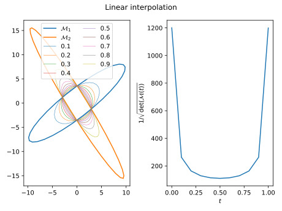

# Metric operations

## Metric interpolation 

- Logarithmic interpolation is used to interpolate between metrics:
$$ \mathcal M(t) = \exp\{(1 - t)  \log(\mathcal M_0) + t \log(\mathcal M_1)\}$$
- It verifies a maximum principle, i.e. if $\det(\mathcal M_0) \le \det(\mathcal M_1)$ then $\det(\mathcal M_0) \le \det(\mathcal M(t)) \le \det(\mathcal M_1)$ for $0 \le t \le 1$
- When interpolating a discrete metric field at $\mathbf x = \sum \alpha_i \mathbf x_i$ is approximated as
$$ \mathcal M(\mathbf x) = \exp\left(\sum \alpha_i \log(\mathcal M_i)\right)$$
- This interpolation is consistent with the assumption of geometric progression of sizes used to approximate the lengths of edges

### Why not linear interpolation?

 

Linear interpolation between $\mathcal M_0$ and $\mathcal M_1$ is given by
$$ \mathcal M(t) = (1 - t)  \mathcal M_0 + t \mathcal M_1$$
and does not respect the maximum principle:

## Metric intersection

- Given two metrics $\mathcal M_1$ and $\mathcal M_2$, the intersection $\mathcal M_{1 \cap 2}$ corresponds to a metric that imposes the largest sizes that are smaller than those imposed by $\mathcal M_1$ and $\mathcal M_2$:
$$ \mathcal M_{1 \cap 2} = \arg \min \{ \det(\mathcal M) |  \mathcal M \in \mathcal S^+ s.t. \mathcal M\ge \mathcal M_1, \mathcal M\ge \mathcal M_2\} $$

 

- It is computed as follows: 
    - Compute the EVD of $\mathcal M = \mathcal M_2^{-1/2} \mathcal M_1 \mathcal M_2^{-1/2} = P^T\Lambda P$
    - Compute $M = \mathcal M_2^{-1/2} P = (e_0 | ... | e_d)$
    - Compute $s_i = mav(e_i^T\mathcal M_1 e, e_i^T\mathcal M_2 e)$
    - $\mathcal M_{1 \cap 2} = \mathcal M_2^{1/2} M diag(s) M^T \mathcal M_2^{1/2}$

let $\mathcal P = (e_0 | ... | e_d)$ be the generalized eigenvectors of $(\mathcal M_0, \mathcal M_1)$:
$$ \mathcal M_0 \mathcal P = \Lambda \mathcal M_1 \mathcal P $$
then
$$ \mathcal M_i = \mathcal P^{-1, T} \Lambda^{(i)} \mathcal P^{(-1)} $$
with $\Lambda^{(i)}_{jk} = e_j^T \mathcal M_i e_k \delta_{jk}$. The intersection is then
$$ \mathcal M_0 \cap \mathcal M_1 = \mathcal P^{-1, T} \Lambda^{(i,j)} \mathcal P^{(-1)}$$ 
with $\Lambda^{(i,j)}_{jk} = \max(\Lambda^{(i)}_{jk}, \Lambda^{(j)}_{jk})$.

See [proof](#maths)

## Metric gradation

- It is sometimes desirable to control how fast edge lengths grow from from element to the next. This idea can be translated into constraints on the variation of the metric field on the edges of the mesh (*Size gradation control of anisotropic meshes*, F. Alauzet, 2010)
- The gradation on an edge $\mathbf e_{i,j} = \mathbf x_j - \mathbf x_i$ is (with $a = l_{\mathcal M_i} (e_{i,j}) / l_{\mathcal M_j} (e_{i,j})$ )
$$\max\left(a, \frac{1}{a} \right)^\frac{1}{l_\mathcal M(e_{i,j})}$$ 
- Given a metric $\mathcal M(\mathbf x) = R^T diag(s_1^2, \cdots s_d^2) R$, is is possible to span a field at any location $\mathbf y$ as
$$ \mathcal M_s(\mathbf x, \mathbf y) = R^T diag(\eta_1^2 s_1^2, \cdots \eta_d^2s_d^2) R$$   
with $\eta_i = 1 + s_i \|\mathbf y - \mathbf x\|_2\log(\beta)$ so that the gradation along $\mathbf y - \mathbf x$ is $\beta$

- In practice a maximum gradation is enforces along edge $\mathbf e_{i,j} = \mathbf x_j - \mathbf x_i$, by modifying $\mathcal M_k$ to
$$\widetilde{\mathcal M_j} = \mathcal M_j \cap \mathcal M_s(\mathbf x_i, \mathbf x_j)$$  
and 
$$\widetilde{\mathcal M_i} = \mathcal M_i \cap \mathcal M_s(\mathbf x_j, \mathbf x_i)$$  
- Achieving a maximum gradation over all the edges in the mesh would require $\#_{edges}^2$ operations; in practices, the above operations is only applied on all the edges of the mesh a small number of times.

## Thresholds on the local sizes

In order to ensure that the metric field will generate meshes with edge sizes between $h_{min}$ and $h_{max}$, the metric $\mathcal M = R^T diag(s_1, \cdots s_d) R$ with $R = (\mathbf v_1| \cdots | \mathbf v_d)$ is modified as
$$\mathcal T(\mathcal M, h_{min}, h_{max}) = R^T diag(\tilde s_1, \cdots \tilde s_d) R$$
with $\tilde s_i = \min\left(\max\left(s_i, \frac{1}{h_{max}^2}\right), \frac{1}{h_{min}^2}\right)$.

## Element-implied metric

- Given an element $K$, defined by its vertices $(\mathbf x_0 , \cdots , \mathbf x_d )$, the element-implied metric is the metric for which the element is equilateral
- If $J_{K, \Delta}$ is the jacobian of the transformation from the reference equilateral element to the physical element, the element-implied metric is 
$$\mathcal M_K = (J_{K, \Delta} J_{K, \Delta}^T)^{-1}$$
-  In practice $J_{K, \Delta}$ is computed as $J_{K, \Delta} = J_{K, \perp} J_{\perp, \Delta}$ where
    - $J_{K, \perp} = (\mathbf x_1 - \mathbf x_0 | \cdots | \mathbf x_d - \mathbf x_0)$ is the jacobian of transformation from the reference orthogonal element to the physical element
    - $J_{\perp, \Delta}$ is the jacobian of transformation from the reference equilateral element to the reference orthogonal element (independent of $K$ )

### Controling the step between two metrics

- In the remeshing process, it may be interesting to limit the step between the element-implied and target metrics
- Given two metric fields $\mathcal M_1$ and $\mathcal M_2$, the objective is to find $\mathcal M = \mathcal L(\mathcal M_1, \mathcal M_2, f)$ *as close as possible* from $\mathcal M_2$ such that, for all edges $e$
$$1/f \le \sqrt{\frac{e^T \mathcal M e}{e^T \mathcal M_1 e}} \le f$$
i.e. to have 
$$1/f \le \lambda_{min}(\mathcal M_1^{-1/2}\mathcal M \mathcal M_1^{-1/2}) \le \lambda_{max}(\mathcal M_1^{-1/2}\mathcal M \mathcal M_1^{-1/2}) \le f$$
- If *as close as possible* is defined as minimizing the Froebenius norm $\|\mathcal M_0^{-1/2} (\mathcal M - \mathcal M_2) \mathcal M_0^{-1/2}\|_F$, the optimal $\mathcal M$ is computed as follows
    - compute $\mathcal N_1 := \mathcal M_0^{-1/2} \mathcal M_1 \mathcal M_0^{-1/2}$,
    - compute the eigenvalue decomposition $Q D Q^T = \mathcal N_1$,
    - compute $\mathcal N^\ast := Q \mathrm{diag}(\hat\lambda_i) Q^T$ where $\hat\lambda_i := \min(\max(\lambda_i, 1/f ), f )$,
    - compute $\mathcal M^\ast := \mathcal M_0^{1/2} \mathcal N^\ast \mathcal M_0^{1/2}$.

 

(the thin blue lines represent $2\mathcal M_1$ and $1/2 \mathcal M_1$)

## Metric scaling

- The "ideal" metric $\mathcal M$ is modified using a series of constraints
  - Minimum and maximum edge sizes $h_{min}$ and $h_{max}$,
  - Maximum gradation $\beta$,
  - Maximum step $f$ with respect to the element implied metric $\mathcal M_i$,
  - A minimum curvature radius to edge lenth ratio $r$ (and optionally $y^+_{target}$), giving a fixed metric $\mathcal M_f$
- A scaling $\alpha$ is applied, such that the actual metric used for remeshing is 
$$ \widetilde{\mathcal M} = \mathcal L(\mathcal T(\alpha \mathcal M, h_{min}, h_{max}) \cap \mathcal M_f, \mathcal M_i, f) $$
- $\alpha$ is chosen to have a given complexity
$$ \mathcal C ( \widetilde{\mathcal M})= \mathcal N$$
- A simple bisection is used to compute $\alpha$ if all the constraints can be met.

##  Maths

###  Math with metrics
- $\mathcal S_n(\mathbb R)$, $\mathcal S_n^+(\mathbb R)$, $\mathcal S_n^{++}(\mathbb R)$ are respectively the ts of symmetric / symmetric positive / symmetric positive definite $n \times n$ real matrices
- the Frobenius norm of a matrix $A \in \mathbb R^{n\times n}$ is 
$$\| A \|_F := \mathrm{tr}(A^TA)^{1/2} = (\sum_{i,j} A_{i,j}^{\,2})^{1/2}$$
and the associated scalar product is $(A, B)_F := \mathrm{tr}(A^T B)$.
- $\leq$ is the partial order in $\mathcal S_n(\mathbb R)$: $S_1 \leq S_2$ if $S_2 - S_1 \in \mathcal S_n^+(\mathbb R)$, i.e. for all $x \in \mathbb R^n$ $x^T S_1 x \leq x^T S_2 x$. If $S_1 \leq S_2$, the sizes imposed by $S_1$ are larger that the sizes imposed by $S_2$

### Metric intersection proof
 
- First, one multiplies by $\mathcal M_1^{-1/2} \in \mathcal S_n^{++}(\mathbb R)$ on each side of the constraints:
 $$\mathcal M_1^{-1/2} \mathcal M_{1\cap2} \mathcal M_1^{-1/2} \ge I_n$$
 $$\mathcal M_1^{-1/2} \mathcal M_{1\cap2} \mathcal M_1^{-1/2} \ge \mathcal M_1^{-1/2} \mathcal M_2 \mathcal M_1^{-1/> 2} \equiv \overline{\mathcal M}_2 $$
- Applying the change of variable $\mathcal M \mapsto \mathcal N := \mathcal M_1^{-1/2} \mathcal M \mathcal M_1^{-1/2}$ and noting that $\det (\mathcal M_1^{1/2} \mathcal N \mathcal M_1^{1/2}) = \det \mathcal M_1 \det \mathcal N$ one gets
$$ \mathcal N_{0 \cap 1} = \arg \min \{ \det(\mathcal N ) |  \mathcal N \in \mathcal S^+ s.t. \mathcal N\ge \mathcal I_n, \mathcal N \ge \overline{\mathcal M_2}\} $$
- Introducing the eigenvalue decompositrion $\overline{\mathcal M}_2 = P^T D P$ with $P^T P = I_n$, and applying the change of variable $\mathcal X := P \mathcal N P^T$ one gets
$$ \mathcal X_{0 \cap 1} = \arg \min \{ \det(\mathcal X) |  \mathcal X \in \mathcal S^+ s.t. \mathcal X\ge \mathcal I_n,  \mathcal X \ge D \} $$
- Introducing $\mathcal Y = \mathcal X^{-1}$ gives
$$ \mathcal Y_{0 \cap 1} = \arg \max \{ \det(\mathcal Y) |  \mathcal Y \in \mathcal S^+ s.t. \mathcal Y\le \mathcal I_n,  \mathcal y \ge D^{-1} \} $$
- Let $\mathcal Z \in \mathcal S_n(\mathbb R)$ such that $\mathcal Y = \mathcal Z^2$, then the Hadamard inequality gives 
$\det \mathcal Y = (\det \mathcal Z)^2 \leq \prod_j | \mathcal Z_{:, j} |_2^2 = \prod_j \mathcal Y_{j,j}$. 
- Using the constraints $\mathcal Y \le \mathcal I_n$ and $\mathcal Y \le D$ gives $\mathcal Y_{j,j} > \max(1, 1/D_{j,j})$ so
$$ \det \mathcal Y \le \prod_j \min(1, 1/D_{j,j})$$ 
- Equality is reached for the diagonal matrix $D^* := \mathrm{diag}( \min(1/D_{ii}, 1))$, which is SPD and verifies $\leq D^\ast \leq I_n$ and $D^\ast \leq D$, so
$$ \mathcal M_{1\cap2} = \mathcal M_1^{1/2} P^T D^\ast P \mathcal M_1^{1/2}$$

### Metric intersection proof: Hadamard inequality
Given a matrix $M = (v_1 | \dots | v_n) \in \mathbb C^{n \times n}$,  
$$ | \det M | \le \prod_{i = 1}^n | v_i |_2$$
with equality iff the $(v_1, \dots, v_n)$ are orthogonal.
