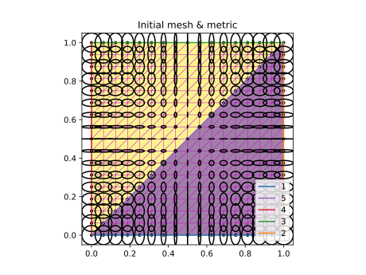
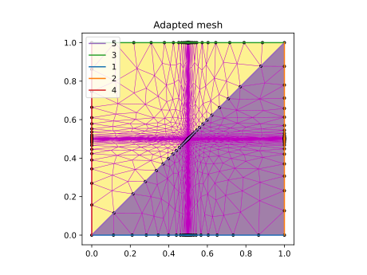
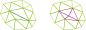
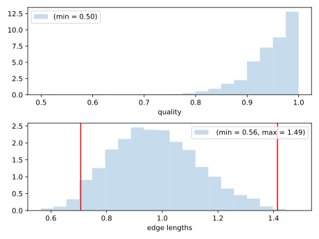

# Remesher

Input metric                 |  Adapted mesh
:---------------------------:|:-------------------------:
 |  

The idea is to perform a series of local modification on an input mesh to have a 
- edge lengths that are of approximately unit length in the metric space
- element qualities as high as possible

In order to ensure the validity of the final mesh, validity is enforced at each step. 

The remeshing algorithm is a sequence of steps applied to the edges or vertices of the mesh
- collapse
- split
- (edge) swap
- smooth

##  Collapse

The *collapse* operation aims at removing "small" edges. It is applied to edges whose length (in metric space) is smaller than $l_0 < 1/\sqrt{2}$. 

It can however introduce
- "long" edges
- element of low quality (including invalid elements)
- a poor representation of the geometry that will be difficult to recovered later

These 3 criteria have to be assessed to determine if a *collapse* operation is accepted or not

## Split

The collapse operations aims at splitting "long" edges. It is applied to edges whose length
 (in metric space) is larger than $l_0 > \sqrt{2}$. 

It can however introduce
- "short" edges
- element of low quality (including invalid elements)

These 2 criteria have to be assessed to determine if a *split* operation is accepted or not

When introducing new vertices on boundaries, a projection step is required to ensure the consistency with the CAD model. 

## Edge swap

The *swap* operation aims at improving the quality of the elements. 

It can however introduce
- "long" or "short" edges
- a poor representation of the geometry that will be difficult to recovered later
- inconsistent tagging

These 3 criteria have to be assessed to determine if a *swap* operation is accepted or not

## Smoothing

The *smoothing* operation aims at improving the quality of the elements by moving vertices to some average of the locations of its neighbors. 

In order to have a consistent smoothing on the boundaries of the computational domain, only the neighbors tagged on the same topological entity or one of its children are considered for smoothing. A projection step is still required for boundary vertices to ensure the consistency with the CAD model. 

TODO: smoothing algorithms

## Remeshing algorithm

The remeshing algorithm is iterative, and consists is multiple passes over the mesh edges / vertices to apply collapse, split, swap and smoothing. 

The detail of the algorithm (order of the steps, number of iterations, criteria for acceptable operation, ...) controls the quality of remeshing as well as computational cost.

While most remeshing libraries share the same basic steps, they use different empirical rules to build the overall algorithm leading to significantly different results. 

## Remeshing quality

Enforcing mesh validity at each remeshing step ensures that the output of the remeshing algorithm is a valid mesh.

Given the remeshing algorithm (split and collapse operations), the target is not to reach a final mesh where all edges are of unit length in metric space, but only that these lengths lie in the interval $(1/\sqrt{2}, \sqrt{2})$

The quality of remeshing is usually considered in terms of the histograms of edge lengths and element qualities. 
