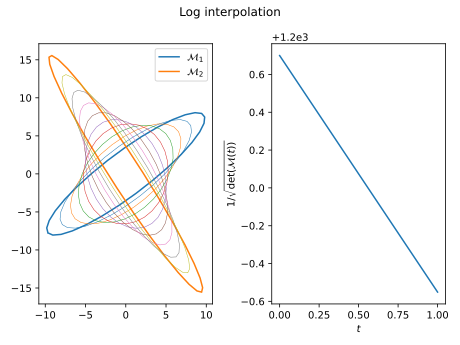
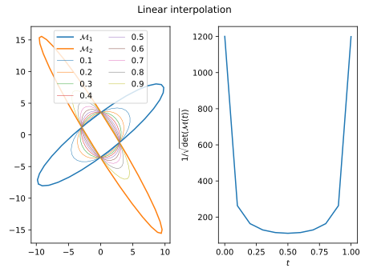

# Riemannian metrics

## Riemannian metric & unit mesh

A Riemanian metric is a symmetric positive definite (SPD) tensor field $\mathcal M(\mathbf x)$, defined everywhere in the computational domain, such that the length of an edge $\mathbf y - \mathbf x$ is given by
$$\ell_{\mathcal M}(\mathbf y - \mathbf x) = \|\mathbf y - \mathbf x\|_{\mathcal M} = \int_0^1 \sqrt{(\mathbf y - \mathbf x)^T \mathcal M((1- t) \mathbf x + t \mathbf y)(\mathbf y - \mathbf x)} dt $$

This field can then be used to define the size and orientations of mesh elements through the generation of a (quasi) unit mesh, i.e. a mesh for which all edges $\mathbf e$ have a unit length:
$$\ell_\mathcal M(\mathbf e) \approx 1$$

## Local sizes and directions

The metric is a SPD tensor: it can be characterized locally by its eigenvalues $(s_1, \cdots, s_d)$ and an orthonormal basis of eigenvectors $(\mathbf v_1, \cdots, \mathbf v_d)$. The edges
$$\mathbf e_i = h_i \mathbf v_i$$
with a local size $h_i = 1 / \sqrt{s_i}$ are unit edges in metric space (if $\mathcal M$ is constant over $\mathbf e_i$ ). 

In order to generate an isotropic mesh with local size $h(x)$, the metric should be $\mathcal M(x) = diag(1/h^2(x), \cdots, 1/h^2(x))$  

## Metric complexity

The physical volume of and equilateral element with unit edges in the (uniform) metric space (i.e. ideal elements) in $d$ dimensions is 
$$ \frac{v_{\Delta}^{(d)}}{\sqrt{\det(\mathcal M)}} \equiv v_{\Delta}^{(d)} \mathcal V(\mathcal M)$$
where $\mathcal V(\mathcal M)$ is the volume associated with metric $\mathcal M$  and $v_{\Delta}^{(d)} = \frac{\sqrt{d+1}}{d!\sqrt{2^d}}$.

The number of ideal elements per unit physical volume is thefore $1/\left(v_{\Delta}^{(d)} \mathcal V(\mathcal M)\right)$ so the ideal elements to fill a domain $\Omega$ is 
$$\frac{1}{v_{\Delta}^{(d)}} \int_\Omega \sqrt{\det(\mathcal M)} dx$$

The complexity is 
$$\mathcal C(\mathcal M) = \int_\Omega \sqrt{\det(\mathcal M)} dx$$

## Discrete metric field

In the context of remeshing, only a discrete metric field is known. A metric $\mathcal M_i$ is defined at each vertex $\mathbf x_i$ of the input mesh. 

### Metric interpolation 

Logarithmic interpolation is used to interpolate between metrics:
$$ \mathcal M(t) = \exp\{(1 - t)  \log(\mathcal M_0) + t \log(\mathcal M_1)\}$$
as it verifies a maximum principle, i.e. if $\det(\mathcal M_0) \le \det(\mathcal M_1)$ then $\det(\mathcal M_0) \le \det(\mathcal M(t)) \le \det(\mathcal M_1)$ for $0 \le t \le 1$

When interpolating a discrete metric field at $\mathbf x = \sum \alpha_i \mathbf x_i$ is approximated as
$$ \mathcal M(\mathbf x) = \exp\left(\sum \alpha_i \log(\mathcal M_i)\right)$$
which is consistent with the assumption of geometric progression of sizes.

### Why not linear interpolation?

 

Linear interpolation between $\mathcal M_0$ and $\mathcal M_1$ is given by
$$ \mathcal M(t) = (1 - t)  \mathcal M_0 + t \mathcal M_1$$
and does not respect the maximum principle:

### Edge length in metric space

In order to compute the length of an edge $\mathbf e_{i,j} = \mathbf x_j - \mathbf x_i$, logarithmic interpolation is considered along the edge leading to:
$$  l_\mathcal M(e_{i,j}) = l_i \frac{a - 1} { a \ln(a)} $$ 
with $l_k = \sqrt{e_{i,j}^T \mathcal M_k e_{i,j}}$ and $a = l_j / l_i$.

## Element quality in metric space

The quality of an element in metric space is given by 
$$q(K) = \beta_d \frac{|K|_{\mathcal M}^{2/d}}{\sum_e ||e||_{\mathcal M}^2}$$ 
where the normalization factor $\beta_d$ is a such that $q = 1$ of equilateral elements: 
- $\beta_2 = 1 / (6\sqrt{2})$
- $\beta_3 = \sqrt{3}/ 4$

The same metric is used to compute all the edge lengths: among the metrics defined at all the vertices of element $K$, the one with minimum volume is used in the formula above

> Invalid elements have a quality $q < 0$
